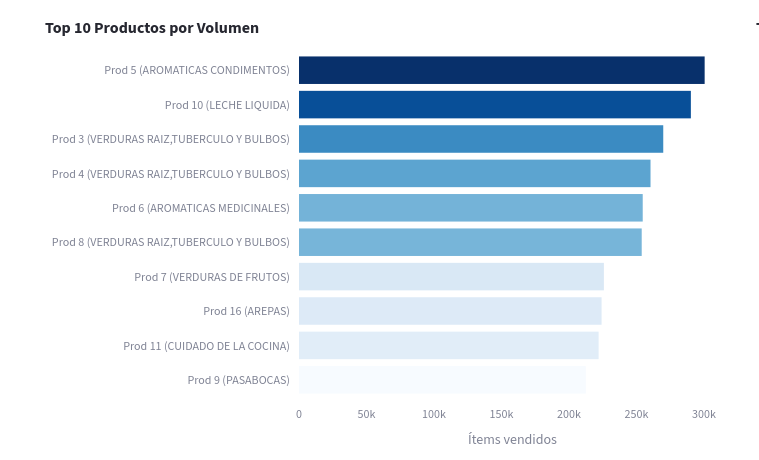
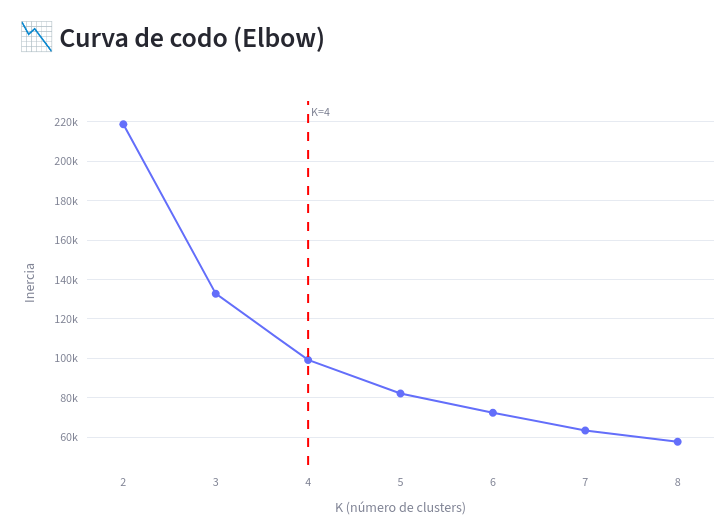

# Informe Técnico: Análisis y Modelado Analítico de Transacciones de Supermercado

## 1. Descripción de los Datos

### 1.1 Fuente y Formato

El dataset consiste en registros de transacciones de compra de una cadena de supermercado colombiana con 4 puntos de venta. Los datos se encuentran distribuidos en 4 archivos CSV con formato pipe-delimited (`|`) y sin encabezado, donde cada fila representa una transacción completa con el siguiente esquema:

```
Fecha | IDTienda | IDCliente | IDProductos (lista separada por espacios)
```

Los productos llegan en formato de *market basket*: cada transacción agrupa todos los ítems comprados en una misma visita. Para el análisis, el dataset se explota a nivel de ítem individual, generando ~10.6M registros de item-transacción.

### 1.2 Características del Dataset

| Aspecto | Valor |
|---|---|
| Periodo temporal | 2013-01-01 a 2013-06-30 (6 meses) |
| Total de transacciones | 1,108,951 |
| Total de ítems transaccionados | 10,591,755 |
| Clientes únicos | 131,186 |
| Productos únicos | 449 |
| Categorías de producto | 39 |
| Tiendas | 4 (IDs: 102, 103, 107, 110) |

### 1.3 Distribución por Tienda

| Tienda | Ítems | Participación | Clientes Únicos |
|---|---|---|---|
| 103 | 4,234,384 | 40.0% | 52,728 |
| 102 | 2,562,322 | 24.2% | 33,147 |
| 107 | 2,410,961 | 22.8% | 30,942 |
| 110 | 1,384,088 | 13.1% | 14,369 |

La tienda 103 es claramente la sede principal, concentrando el 40% del volumen total y la mayor base de clientes.

### 1.4 Consideraciones sobre los Datos

- **Ausencia de precios:** No se dispone de montos de pago, por lo que todas las métricas son relativas (frecuencia, volumen de ítems, diversidad de compra).
- **Categorías:** Los productos se clasifican en 39 categorías a través de un catálogo auxiliar (`ProductCategory.csv`). Existe una categoría `SIN CATEGORIA` que agrupa productos sin clasificar (16.97% del volumen).
- **Sin duplicados temporales:** Cada fila es una transacción única por fecha, tienda y cliente.

---

## 2. Metodología de Análisis

### 2.1 Pipeline ETL

El procesamiento de datos sigue un pipeline de tres etapas implementado en Python con Pandas:

1. **Carga (`loader.py`):** Lectura de los 4 archivos CSV con separador `|`, parsing de fechas y construcción de diccionarios de categorías.
2. **Transformación (`transformer.py`):** Explosión del campo `basket_raw` a filas individuales, enriquecimiento con variables temporales (día de semana, semana del año, mes) y asignación de categorías. Generación de tablas agregadas: resumen diario, features de clientes y frecuencias de productos.
3. **Precomputo (`precompute.py`):** Los DataFrames procesados se serializan en formato Parquet (columnar, comprimido) y se almacenan tanto localmente como en Google Cloud Storage, reduciendo el tiempo de carga en la aplicación mediante `@st.cache_data`.

### 2.2 Analítica Descriptiva

Se calcularon indicadores de resumen ejecutivo y visualizaciones exploratorias:
- KPIs de alto nivel (totales, promedios)
- Top 10 productos y clientes por volumen
- Heatmap de días pico de compra
- Distribución de categorías (gráfico de pastel)
- Serie de tiempo diaria/semanal con desglose por tienda
- Boxplot de distribución de comportamiento de clientes
- Heatmap de correlaciones entre variables de comportamiento

### 2.3 Segmentación de Clientes (K-Means)

**Variables utilizadas:** frecuencia de visitas, número de productos distintos comprados, volumen total de ítems y número de categorías distintas exploradas.

**Proceso:**
1. Estandarización con `StandardScaler` (media 0, desviación 1)
2. Selección de K mediante curva del codo (análisis de inercia para K=2 a K=8)
3. Ajuste final con K=4 (`KMeans`, `random_state=42`, `n_init=10`)
4. Reducción dimensional con PCA(2) para visualización del clustering

### 2.4 Recomendador de Productos (FPGrowth + Similitud Coseno)

**Por producto — Reglas de Asociación:**
- Algoritmo FPGrowth (`mlxtend`) sobre una muestra del 30% de transacciones
- Parámetros: soporte mínimo = 0.01, confianza mínima = 0.3
- Métrica de ranking: lift (cociente entre confianza observada y soporte esperado)
- Las reglas se precomputan y almacenan en Parquet para consulta en tiempo real

**Por cliente — Similitud Coseno:**
- Construcción de matriz cliente × categoría (frecuencias de compra)
- Reducción dimensional con `TruncatedSVD` (100 componentes)
- Cálculo de similitud coseno del cliente objetivo vs. todos los demás
- Recomendación de categorías compradas por vecinos similares pero no por el cliente

---

## 3. Principales Hallazgos Visuales

### 3.1 Resumen Ejecutivo

El análisis abarca **1,108,951 transacciones** que generan **10.6 millones de ítems** transaccionados a lo largo de 6 meses. La cadena mantiene un ritmo promedio de **6,127 transacciones diarias** con picos de hasta 9,475 transacciones (registrado el 15 de junio de 2013).

El tamaño promedio de canasta es de **9.55 ítems** (mediana: 6), lo que refleja un perfil de compra orientado a abastecimiento frecuente con cantidades moderadas.

### 3.2 Categorías y Productos Más Vendidos

**Por categoría agregada:**

Las categorías dominantes pertenecen al área de perecederos, con **Verduras Raíz, Tubérculos y Bulbos** liderando con el 17.1% del volumen total:

| Categoría | Ítems | Participación |
|---|---|---|
| VERDURAS RAÍZ, TUBÉRCULO Y BULBOS | 1,811,515 | 17.10% |
| SIN CATEGORÍA | 1,797,104 | 16.97% |
| VERDURAS DE FRUTOS | 1,410,744 | 13.32% |
| VERDURAS DE HOJAS | 729,510 | 6.89% |
| AROMÁTICAS CONDIMENTOS | 491,893 | 4.64% |

**Por producto individual:**



Los **top 10 productos más frecuentes** son liderados por Aromáticas/Condimentos (prod. 5, presente en el 50.24% de los clientes) y Leche Líquida (prod. 10, 45.09%), indicando que los productos de uso cotidiano y básicos alimenticios dominan el perfil de compra.

### 3.3 Patrones Temporales

**Días pico de compra:**

| Día | Ítems Totales |
|---|---|
| Domingo | 1,926,642 |
| Sábado | 1,860,944 |
| Martes | 1,606,570 |
| Jueves | 1,506,577 |
| Lunes | 1,301,747 |
| Viernes | 1,213,591 |
| Miércoles | 1,175,684 |

El fin de semana concentra el mayor tráfico, con domingo como el día de mayor actividad. Los miércoles presentan la menor actividad, siendo un día estratégico para campañas de fidelización.

**Evolución mensual:** El volumen de transacciones es estable a lo largo de los 6 meses (rango 170K–193K transacciones/mes), con una leve tendencia de crecimiento hacia junio. No se observan caídas pronunciadas, lo que indica demanda estable.

| Mes | Transacciones |
|---|---|
| Enero | 184,912 |
| Febrero | 170,766 |
| Marzo | 189,305 |
| Abril | 182,627 |
| Mayo | 188,194 |
| Junio | 193,147 |

### 3.4 Correlaciones entre Variables de Comportamiento

La matriz de correlación de las 4 variables de clientes revela relaciones fuertes:

| Par de variables | Correlación |
|---|---|
| volumen_total ↔ n_productos_distintos | **0.850** |
| frecuencia ↔ volumen_total | 0.845 |
| n_productos_distintos ↔ n_categorias_distintas | **0.901** |
| frecuencia ↔ n_categorias_distintas | 0.708 |

La alta correlación entre diversidad de productos y diversidad de categorías (0.901) sugiere que los clientes que exploran más categorías también compran mayor variedad de productos individuales. El volumen total es la variable más transversal, correlacionando fuertemente con todas las demás.

---

## 4. Resultados del Modelo de Segmentación y Recomendación

### 4.1 Segmentación de Clientes (K-Means, K=4)

**Selección de K:** La curva del codo muestra una reducción notable de inercia hasta K=4, con retornos decrecientes a partir de K=5. Se seleccionó K=4 como punto de quiebre óptimo.

| K | Inercia |
|---|---|
| 2 | 218,794 |
| 3 | 132,774 |
| **4** | **99,163** ← óptimo |
| 5 | 82,115 |
| 6 | 72,342 |



La gráfica confirma que el codo se presenta claramente en K=4: la pendiente de descenso es pronunciada hasta este punto y se vuelve plana después, indicando que adicionar más clusters no aporta reducción significativa de inercia.

**Perfiles de los 4 segmentos:**

| Segmento | Clientes | % | Frecuencia | Volumen | Prods. Distintos | Categorías |
|---|---|---|---|---|---|---|
| 0 — Compradores Ocasionales | 66,396 | **50.6%** | 2.2 | 9.3 | 8.0 | 5.4 |
| 2 — Compradores Regulares | 38,360 | **29.2%** | 7.9 | 63.9 | 37.0 | 18.1 |
| 1 — Compradores Frecuentes | 20,664 | **15.8%** | 19.7 | 215.6 | 74.7 | 26.9 |
| 3 — Clientes VIP | 5,766 | **4.4%** | 42.7 | 532.4 | 114.5 | 31.3 |

**Interpretación de segmentos:**

- **Segmento 0 — Compradores Ocasionales (50.6%):** Constituyen la mayoría de la base pero con interacción mínima. Visitan muy ocasionalmente (2-3 visitas durante los 6 meses), compran pocas categorías (5.4 en promedio) y bajo volumen. Son clientes de paso o compras de emergencia.

- **Segmento 2 — Compradores Regulares (29.2%):** Perfil intermedio con ~8 visitas y 18 categorías distintas. Representan la columna vertebral del negocio diario: clientes habituales que cubren necesidades del hogar de manera consistente.

- **Segmento 1 — Compradores Frecuentes (15.8%):** Alta frecuencia, Clientes que vienen regularmente (20 veces en 6 meses) y compran en muchas categorías. Son la espina dorsal del negocio. Son ideales para ofrecerles productos complementarios, ya que es fácil que prueben cosas nuevas.

- **Segmento 3 — Clientes VIP (4.4%):** Clientes de altísimo valor: 43 visitas en 6 meses (~7 por semana), 532 ítems y 31 categorías diferentes. Representan el núcleo de clientes premium y son los más susceptibles a programas de fidelización.

### 4.2 Recomendador de Productos

#### A. Reglas de Asociación (FPGrowth)

Se generaron **3,869,951 reglas de asociación** con los parámetros configurados, lo que refleja la alta interconexión entre productos en las canastas de compra.

**Métricas globales:**
- Lift promedio: **6.59** (muy superior a 1.0, indicando asociaciones no triviales)
- Confianza promedio: **0.501** (50% de probabilidad de compra conjunta)

**Top reglas por lift:**

Las reglas de mayor lift (>16x) involucran combinaciones de 4+ productos de las categorías de verduras y vegetales frescos, lo cual es consistente con el perfil de compra de un supermercado enfocado en perecederos. Un lift de 16 indica que la probabilidad de compra conjunta es **16 veces mayor** de lo que se esperaría si los productos fueran independientes.

Ejemplo de regla destacada:
> Si el cliente compra productos {3, 21, 22, 30} → compra {9, 14, 16, 20} con **confianza 38.9%** y **lift 16.24**

#### B. Recomendador por Cliente (Similitud Coseno)

El modelo construye una representación vectorial de cada cliente basada en su frecuencia de compra por categoría. Mediante TruncatedSVD (100 componentes) se reduce la dimensionalidad de la matriz cliente×categoría, y la similitud coseno identifica los vecinos más parecidos en comportamiento. Las categorías no compradas por el cliente pero frecuentes entre sus vecinos se recomiendan como oportunidades de descubrimiento.

---

## 5. Conclusiones y Aplicaciones Empresariales

### 5.1 Conclusiones del Análisis

1. **Concentración en perecederos:** El negocio de la cadena está fuertemente anclado en productos frescos (verduras, aromáticas), lo que implica ciclos de reposición cortos y alta frecuencia de visita. Esto explica el tamaño promedio de canasta relativamente bajo (9.5 ítems) comparado con supermercados de gran superficie.

2. **Base de clientes fragmentada:** El 50.6% de los clientes son compradores ocasionales, lo que representa una oportunidad significativa para programas de conversión hacia compra regular. El segmento VIP (4.4%), pese a ser pequeño, genera un volumen desproporcionado y debe ser protegido con programas de fidelización diferenciados.

3. **Patrones de compra predecibles:** La estabilidad mensual del volumen de transacciones y la concentración en fin de semana permiten planificar operaciones (personal, inventario, logística) con alta certeza.

4. **Asociaciones fuertes entre productos frescos:** Los lifts >16x en reglas de productos frescos sugieren que los clientes tienden a realizar compras de "cesta completa" de vegetales en una sola visita, lo cual es aprovechable para diseño de layout en tienda y promociones cruzadas.

5. **Alta diversificación de clientes frecuentes:** Los clientes de los segmentos 1 y 3 compran en promedio más de 70 productos distintos y más de 25 categorías, lo que los hace ideales para estrategias de expansión de categorías o lanzamiento de nuevos productos.

### 5.2 Aplicaciones Empresariales

| Aplicación | Descripción | Segmento Objetivo |
|---|---|---|
| **Programa de fidelización VIP** | Beneficios exclusivos (descuentos, entrega prioritaria) para clientes del Segmento 3, que visitan la tienda ~7 veces/semana | Segmento 3 |
| **Campañas de activación** | Cupones de descuento personalizados para reactivar clientes ocasionales (Segmento 0) y convertirlos en regulares | Segmento 0 |
| **Bundles y paquetes de temporada** | Usar las reglas de asociación de alto lift para crear combos preempacados de verduras y aromáticas | Todos |
| **Optimización de layout en tienda** | Posicionar productos con alto lift adyacentes en el punto de venta para estimular compras impulsivas | Operaciones |
| **Recomendaciones personalizadas en app** | Usar el recomendador por cliente para notificaciones push ("Clientes como tú también compraron...") | Segmentos 1 y 2 |
| **Gestión de inventario por día** | Reforzar stock los domingos y sábados (días pico); reducir el miércoles (día valle) | Operaciones |
| **Estrategia de expansión de categorías** | Identificar categorías poco exploradas por clientes frecuentes para introducirlos mediante muestras o descuentos en primera compra | Segmentos 1 y 3 |

### 5.3 Limitaciones y Trabajo Futuro

- **Ausencia de precios:** Incorporar datos de precio permitiría calcular valor monetario de cada segmento (análisis RFM completo) y optimizar la rentabilidad, no solo el volumen.
- **Granularidad temporal limitada:** Con datos de un solo semestre no es posible modelar estacionalidad anual. Con más periodos se podría aplicar modelos de forecasting (Prophet, SARIMA).
- **Enriquecimiento de perfiles:** La adición de datos demográficos (edad, zona geográfica) permitiría personalización más profunda en las recomendaciones.
- **Modelos más avanzados:** El recomendador podría mejorarse con algoritmos de factorización matricial (ALS, BPR) o redes neuronales para capturar patrones no lineales en el comportamiento de compra.
